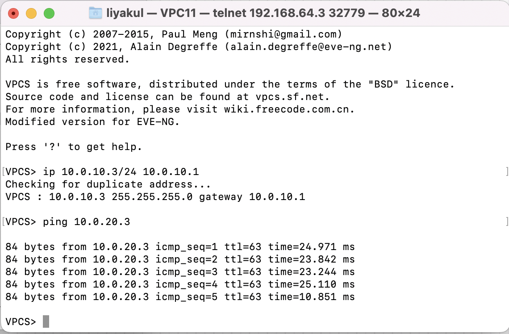

Client2 (VPC10) назначен ip 10.0.20.3 с маской 255.255.255.0(/24), так как он находится в сети 10.0.20.0/24 и gateway 10.0.20.1 
Аналогично, Client1 (VPC11) - ip 10.0.10.3/24 и gateway 10.0.10.1.

Далее происходит настройка портов коммутаторов. 
e0/0-2 у коммутатора уровня распределения переводятся в mode trunk и разрешается передача сообщений vlan 10,20. Также, чтобы коммутатор стал корневым для vlan 1,10,20, выставляется priority для spanning-tree.
У коммутаторов уровня распределения на e0/0-1 аналогично выставляется mode trunk и allowed vlan 10,10. У e0/2 выставляется access mode и разрешается передача сообщений нужного vlan (в зависимости от подключенного клиента).
Можно проверить, что R14 стал корнем и линк между коммутаторами уровня доступ заблокирован. Также, для обеспечения отказоустойчивости используется spanning-tree mode rapid-pvst (+ он дает более быстрое переключение порта).

Клиенты могут отправлять друг другу PING и видят друг друга:

Конфиги доступны в папке configs.

Команды для ethernet между коммутаторами и/или роутером:  
int range e0/0-2 (или e0/0-1)  
switchport trunk encapsulation dot1q  
switchport mode trunk  
switchport trunk allowed vlan 10,20

Команды для ethernet между коммутатором и клиентом:  
int e0/2  
switchport mode access  
switchport access vlan 10 (or 20)  

Настройка корня дерева:  
spanning-tree vlan 1,10,20 root primary 

Настройка spanning-tree и vlan:  
vtp mode transparent  
spanning-tree mode rapid-pvst  
(+write)  

Настройка e0/0.2 для роутера (e0/0.3 аналогично):  
int e0/0.2  
encapsulation dot1Q 10  
ip address 10.0.10.1 255.255.255.0  

Также у меня возникла проблема с duplex (на роутере был full duplex, на коммутаторе half duplex).  
Решалось комадной на роутере:  
int e0/0  
duplex half  