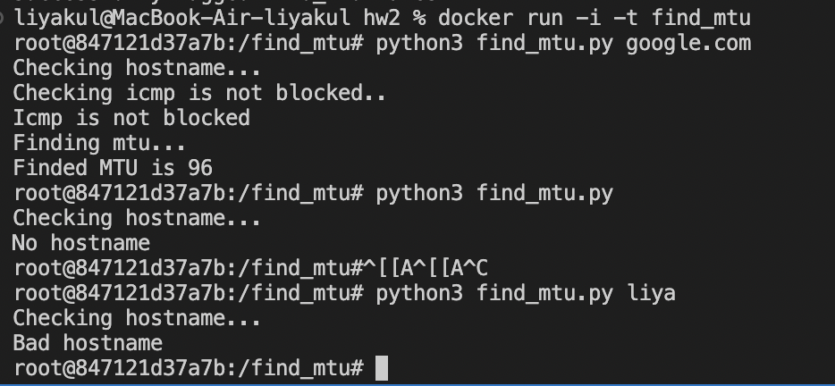
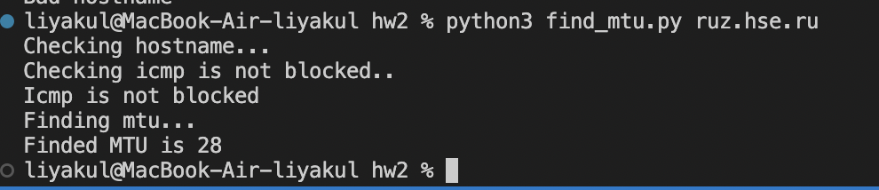

Если host не выставлен, по умолчанию выставляется пустая строка, после чего программа завершается.
socket.gethostbyname(host) проверяет host на корректность.
Если адрес недоступен, то это отразится в answer.returncode в функции request.
Оптимальное значение ищется двоичным поиском, левая граница установлена как маскимальный MTU (в jumbo сетях).
Также выполнена проверка на то, что icmp не заблокирован.

Сборка докера и запуск скрипта:
```
docker build -t find_mtu -f Dockerfile .
docker run -i -t find_mtu 
python3 find_mtu.py <hostname>
```

Проверка в докере:

Проверка на маке:

