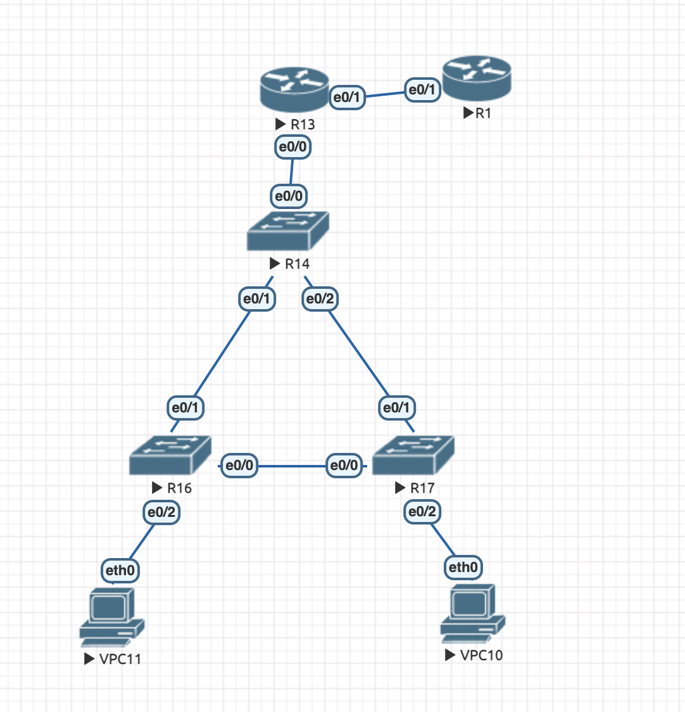
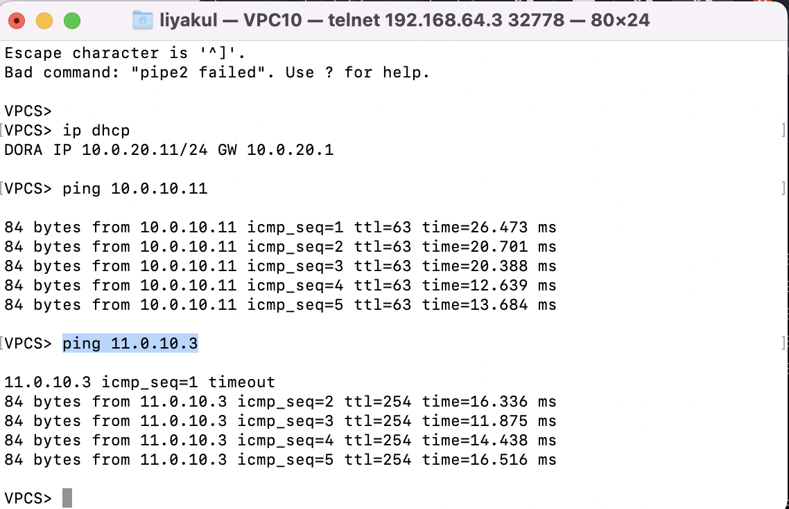
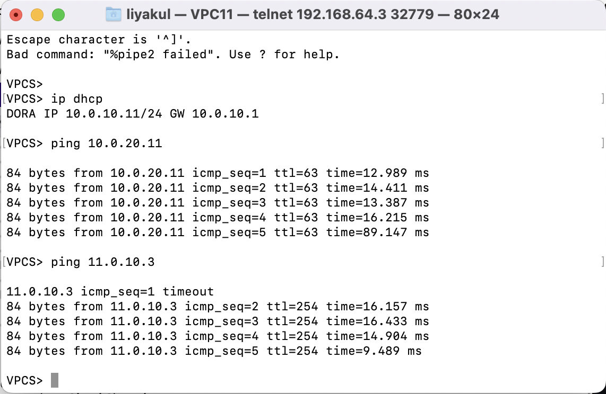

Топология сети:

Для коммутаторов ничего не меняется по настройкам, все также как в прошлом дз.

Порядок выставления данных для передачи клиентам по dhcp:\
ip dhcp excluded-address 10.0.10.0 10.0.10.10 - исключаем первые 10 адресов сети\
ip dhcp pool pool10 - создаем pool для подсети\
dns-server 10.0.10.3 - ip для клиента\
network 10.0.10.0 255.255.255.0 - задаем сеть и маску клиента\
Аналогично со второй подсетью.

Теперь настроим nat. Для поддержания количества клиентов >10 используем pat. На gateway (R13):\
ip nat pool pool10 10.0.10.11 10.0.10.255 netmask 255.255.255.0 - выставляем pat для pool10\
access-list 100 permit 10.0.10.0 0.0.0.255 - выставляем access-list на сеть\
ip nat inside source list 100 pool pool10 overload\
int e0/0\
    ip nat inside\
int e0/1\
    ip address 11.0.10.1 255.255.255.0\
    ip nat outside

На R1:\
int e0/1\
    ip address 11.0.10.3 255.255.255.0

Клиент получает сетевые настройки по dhcp + проверка на доступность другого клиента и верхнего маршрутизатора:

С помощью команды "ip dhcp" клиенты получают нужные данные.
