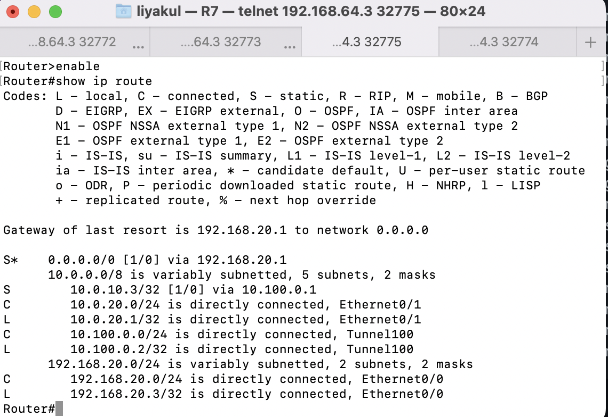

Топология сети:

Проверка на доступ между клиентами и отсутствие связи между 2 и 3 клиентом:

Проверка на связь между маршрутизаторами

Между 1 и 2, 1 и 3 клиентом установлена передача данных через gre, также между 1 и 3 есть IPSec.
mtu установлен на 1400, mss - 1360.
